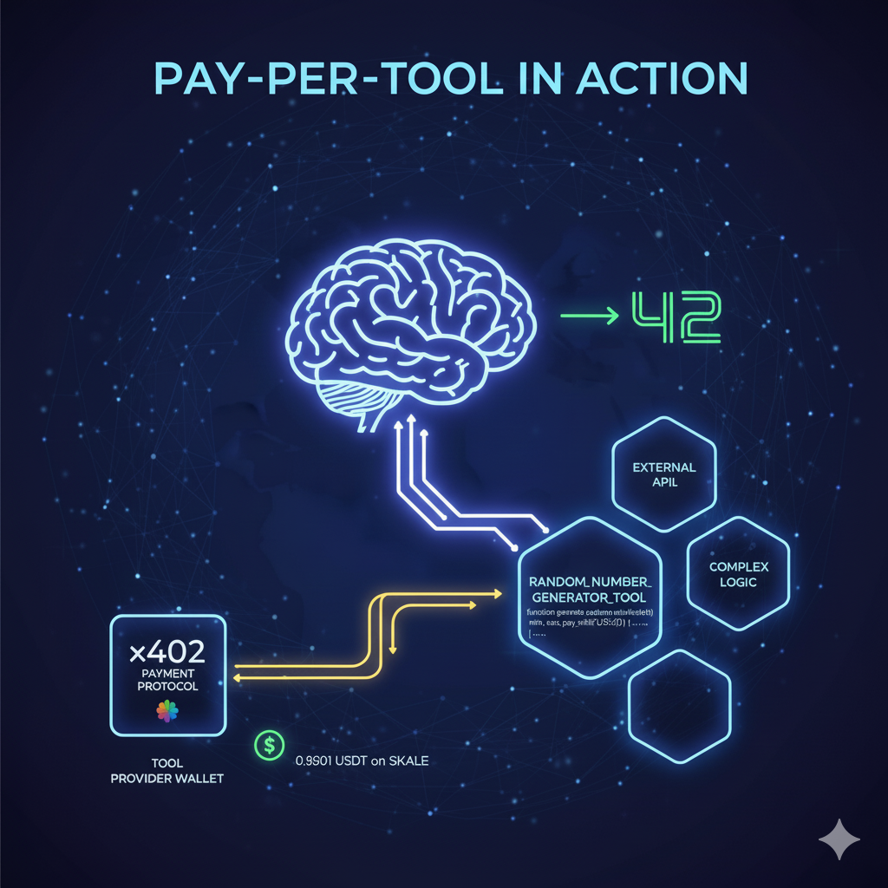

# The Role of Pay-Per-Tool in an Agentic World

The role of agents and AI tooling is expanding very quickly. With 
new releases, tools, models, and innovations coming out every day, it's important to understand the role of tools in agentic systems and why the consumption model may be in need of an economic change. This blog introduces the concept of a tool, walks through an example of a tool, and explores why pay-per-tool is the next logical step.

## What is a tool?

Tools are software designed to perform a specific task that are designed to be called by language models. A tool can provide access to complex programming logic, external APIs, or even other models.

One of the more common tools that is used across many agentic applications is the ability to search the web. With models being trained on specific sets of data, they tend to have a *cutoff date*, which is when the information used to train the model was last updated.

This means that for an LLM to have access to the most recent information, it needs to be able to crawl the web and retrieve up-to-date info.

Looking at [OpenAI](https://platform.openai.com/docs/guides/tools), their standard set of tools includes web search, calling to remote MCPs, file search, image generation, code interpreter, and more.

In summary, tools are a critical component of agentic systems that allow large and small language models to have access to more information and functionality that may not be available in the model directly.

## Why is Pay-Per-Tool the next logical step?

As AI continues to grow in both complexity and usage, a major question is the cost of services and information. It's no secret that the cost of operations for artificial intelligence is enormous, with a significant amount of subsidization and free usage being offered by many of the top companies.

However, as the technology continues to mature and become more mainstream, specifically mainstream for agentic use cases beyond prompt-based LLMs like ChatGPT and Claude, there is a need for agents to have access to more functionality and information—but at whose expense?

Cloudflare introduced [pay per crawl](https://blog.cloudflare.com/introducing-pay-per-crawl) to address the changing landscape of consumption. While the motives were slightly different, the end goal is the same: to allow compensation for access to resources.

The next logical step is to explore a high-level view of how pay-per-tool covers a number of tools and how it can be used to create a more dynamic and scalable agentic system.

## How does Pay-Per-Tool work?

Pay-per-tool is a concept or view of how a simple flow of an agent calling a tool pays for the resource and the provider of the resource receives compensation.

Using x402, tools can be paid for per use. This means that the user only pays for the tool they use rather than signing up for hundreds of subscriptions. Additionally, this allows tooling providers to properly pass on the costs as the internet changes and pay-per-crawl becomes a reality.

More specifically, pay-per-tool is already being explored through a number of open protocols, including the [Agent Payment Protocol](https://ap2-protocol.org) from Google, [x402](https://x402.org) from Coinbase, and [Agentic Commerce Protocol](https://www.agenticcommerce.dev) from OpenAI and Stripe.

## x402: The Default Solution for Pay-Per-Tool

x402 is the internet-native payments protocol from Coinbase that is designed to work within the traditional internet by utilizing the mostly (previously) dormant HTTP 402 status code for `payment required`.

This allows existing web services like APIs and websites to easily adopt the protocol and start charging for access. We have already seen x402 explored in collaboration with other protocols like AP2 from Google and the ERC-8004 trustless agents framework being put forward by the Ethereum Foundation.

The reason I believe x402 is so key and will play such a big role is a combination of the simplicity and extensibility of the protocol itself. The current design has already allowed a number of services providing tools for agents like Firecrawl and Freepik to start enabling agentic access without the need to build a new API or develop a complex payment system.

## Blockchain Scalability and Costs

One of the larger value propositions that x402 brings to the table is the ability to have payments move at the speed of blockchains instead of traditional financial institutions. In reality, even Ethereum with ~12-minute finality is still faster than most traditional credit card payment settlement and ACH/cross-border processing times.

As you start to explore alternative Layer 1 blockchains like Solana, the speed of settlement becomes even more apparent with ~12–15 seconds of finality.

My belief is and always will be that the fastest will never be good enough and will always be too slow. As more entities begin utilizing blockchain infrastructure for their operations, the speed of settlement will only continue to decrease.

Based on the above, the best blockchain in the world today for real-time payments, especially for agentic micropayments, is [SKALE](https://skale.space).

With instant single-slot finality, consensus is completed in just a single block that is processed and executed in around one second on the current architecture. This can be sped up by improving consensus, resizing chains, changing node location (see Hyperliquid), and even improving hardware of the nodes.

However, even if all of that were to be done (see Solana), the speed of settlement is still not enough, with the costs of agentic tools needing to be valued to the tune of billions of requests per day.

The words "it's cheap enough" have been spoken by teams building on blockchain for the last 5+ years and have so far proven true. Why? Outside of the occasional spike, the costs of operations have been consistently good enough for current use cases to the tune of hundreds of transactions per second.

### A Scalability Scenario

Cloudflare, as of 2023, was serving 46 million HTTP requests per second according to [Alex Bocharov's blog post](https://blog.cloudflare.com/scalable-machine-learning-at-cloudflare/).

Breaking this down, let's assume 0.01% of these requests are agents searching the web. This would equate to 4,000 requests per second—fully capable of being handled by a single SKALE Chain.

Using an arbitrary cost of 70,000 gas units per micropayment, the expected block gas limit would need to be at least 280,000,000 gas units per block (just to cover the consumption of the micropayments) excluding any other usage. SKALE, having one of the largest block gas limits at ~268,000,000 gas units per block, would be able to handle this with ease just by bumping the gas limit slightly.

Most EVM chains tend to limit the gas limit to ~30–50 million gas units per block, as they lack the capacity to handle this amount of compute.

Additionally, with most blockchains being designed to increase the base gas fee per block as the demand for compute increases from block space being filled, the cost of operations would continue to spike and stay elevated on most blockchains under this type of load.

Even Solana, with local fee markets, would see elevated costs due to constant interaction with specific accounts.

SKALE, on the other hand, operates more like a decentralized cloud provider—offering pre-paid compute resources and the ability to quickly add more compute to handle spikes in demand. SKALE is capable of handling the above scenario with zero spikes in cost due to the pre-paid nature of the network.

This means that while other networks would come to a standstill and see massive volatility and potential stability issues, SKALE would be able to handle the needed load to serve a significant portion of the onchain settlement of micropayments via x402 for agents on just a single SKALE Chain.

Additionally, SKALE is almost able to add an infinite amount of SKALE Chains. This means that as more agents come online, more chains can be procured to handle the ever-increasing demand. Forty million requests per second could be handled by 4,000 sChains, each serving 10,000 requests per second.

With thousands or even tens of thousands of servers in data centers and locations from many providers scattered all over the world, this is an incredibly feasible scenario for SKALE to be positioned to handle for the agentic world.

### Reducing Costs to Increase Demand

One of the biggest challenges facing the adoption of pay-per-tool is the cost of operations combined with onchain costs and limits. With gas fees on chains like Solana and Base—both of which are two of the more popular x402 chains today—being around ~$0.001 for a single transaction, that is close to 15% of the actual cost of the payment being around $0.01, which is the most common cost for an x402 payment today.

This is a major barrier to entry for many providers and users alike. The cost of operations is too high, and the onchain costs are too high.

With the reduction or removal of gas fees, the cost of operations can be scaled down significantly. This is especially relevant for many x402-enabled endpoints that are currently being used to serve basic content like images, text, price feeds, and more that can arguably cost a fraction of a penny to serve.

By scaling the costs down, agents can now afford to do more without the fear of running out of funds or being throttled by the human-set budget.

With zero gas fees and instant finality, the cost of operations can be scaled down to literally one wei on a SKALE Chain in any token, with far more complex settlement and management contracts.

## Conclusion

The future of agentic systems is looking bright, but the cost of operations and the ability to scale is a major concern. The vision of pay-per-tool is key to ensuring that the future of agentic systems is capable of scaling to meet the needs of the growing market while being built in a way that is sustainable for providers and users alike.

If you are interested in deploying your own MCP server, agent, or resources for the agentic world on SKALE, reach out to me with the information below.

import Footer from '../../snippets/_footer.mdx'

<Footer />